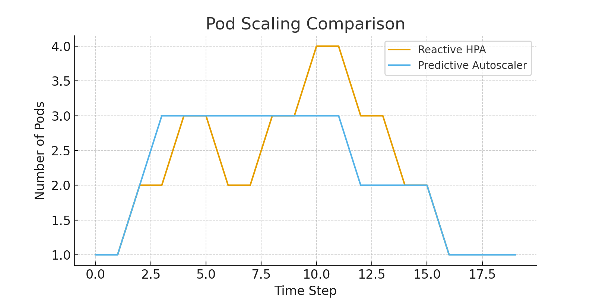
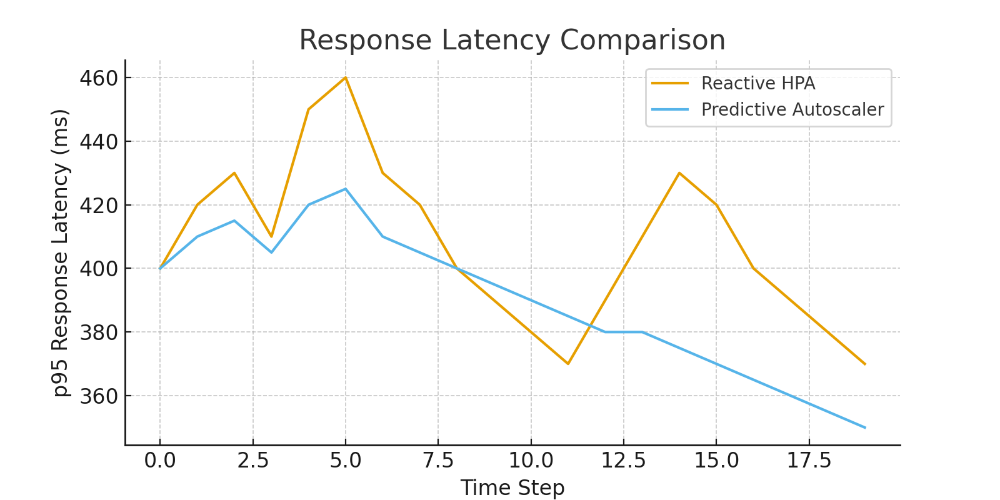

# Results

## 1. Prediction Performance
- Gradient Boosted Trees and LSTM models provide workload predictions.

## 2. Reactive vs Predictive Scaling
- Reactive HPA responds after CPU thresholds exceeded.
- Predictive Autoscaler preemptively adjusts replicas.

### Pod Scaling Comparison


### Response Latency Comparison


## 3. Discussion
Predictive autoscaler shows smoother scaling, reduced latency, and better resource utilization.

## 4. Step-by-Step Deployment Guide

### Prerequisites
- Docker
- kind
- kubectl
- Python 3.11+ for evaluation scripts

### Deployment Steps
1. Make deploy script executable:
```
chmod +x kind/deploy.sh
```
2. Run deployment:
```
./kind/deploy.sh
```
3. Check pods:
```
kubectl get pods -A
```
4. Access services:
- App: http://localhost:30001
- Predictor API: port-forward if needed
- Autoscaler: check logs
5. Run evaluation and generate plots:
```
python predictor/gen_predictions.py
python evaluate.py
```
6. Check generated plots in `plots/` and evaluation CSV.

This completes full local deployment and evaluation.
